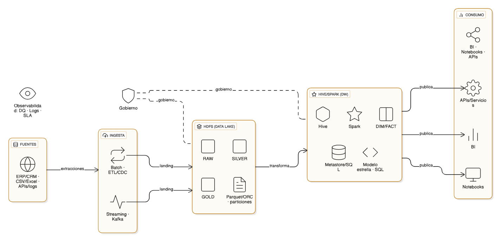

# ARQUITECTURA INICIAL

## FUENTES (Sources) 

Este es el punto de partida de los datos. Los fuentes de datos son: 

* Utilidades de clientes en cada cambio Datos 
* historicos de utilidades en periodos pasados por dia util 
* Utilidades generada por ejecutivo por cada canal 
* Numero de comunicaciones hechas por mes 
* Performance de comunicaciones

 

## INGESTA (Ingestion) 

Es la fase donde se capturan los datos de las fuentes y se preparan para su almacenamiento. Hay dos métodos principales mostrados: 

Batch - ETL/CDC: Para procesar datos en lotes. Se usan herramientas de ETL (Extract, Transform, Load) para extraer, transformar y cargar datos de manera periódica, o de CDC (Change Data Capture) para capturar solo los cambios en la fuente. 

Streaming - Kafka: Para datos en tiempo real. Kafka es una plataforma de streaming que maneja flujos de datos continuos. 

 

## HDFS (DATA LAKE) 

Los datos ingeridos se almacenan en un Data Lake utilizando HDFS (Hadoop Distributed File System). Este lago de datos está estructurado en diferentes "capas" de calidad: 

### RAW
La primera capa, donde los datos se almacenan tal como vienen de las fuentes, sin ninguna modificación. 

### SILVER
La segunda capa, donde los datos son limpiados, estandarizados y enriquecidos. Aquí se resuelven problemas de calidad de datos. 

### GOLD
La capa final, con datos de alta calidad. Contiene tablas agregadas y optimizadas, listas para el consumo. Aquí se usan formatos de archivo como Parquet u ORC y particiones para mejorar el rendimiento de las consultas. 

 

## HIVE/SPARK (DW) 

Desde la capa GOLD, los datos transformados se mueven a un Data Warehouse (DW). Aquí se utilizan herramientas para procesar y consultar los datos: 

### Hive
Permite realizar consultas SQL sobre los datos almacenados en el Data Lake. 

### Spark
Un motor de procesamiento distribuido para transformaciones complejas. 

### Modelo estrella - SQL
Los datos se organizan en un esquema de estrella, que es un diseño optimizado para consultas analíticas, con tablas de hechos y tablas de dimensiones. 

 

## GOBIERNO (Governance) y OBSERVABILIDAD (Observability) 

Estas son capas transversales que aseguran la calidad y el monitoreo del sistema: 

Gobierno: Asegura que los datos sean consistentes, seguros y cumplan con las políticas de la organización a lo largo de todo el proceso de ingesta y almacenamiento en el Data Lake. 

Observabilidad: Se refiere al monitoreo del pipeline. Incluye la calidad de los datos (D.Q.), el registro de eventos (Logs) y el cumplimiento de los acuerdos de nivel de servicio (SLA). 

 

## CONSUMO (Consumption) 

La etapa final, donde los datos están disponibles para los usuarios finales y las aplicaciones. 

BI: Herramientas de Inteligencia de Negocios para crear reportes y dashboards. 

Notebooks: Para que los científicos e ingenieros de datos realicen análisis exploratorios y desarrollen modelos. 

APIs/Servicios: Permite que otras aplicaciones accedan a los datos del Data Warehouse de manera controlada. 

 
